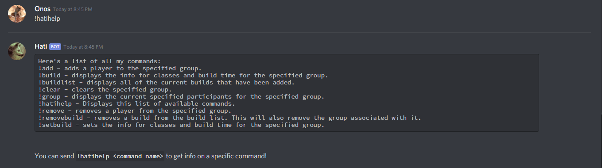
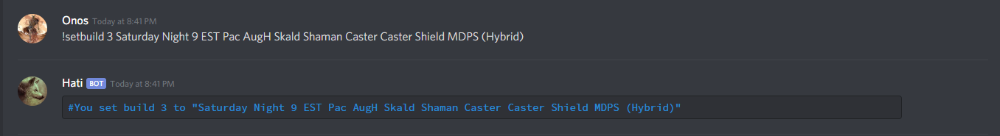
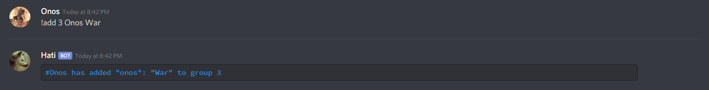
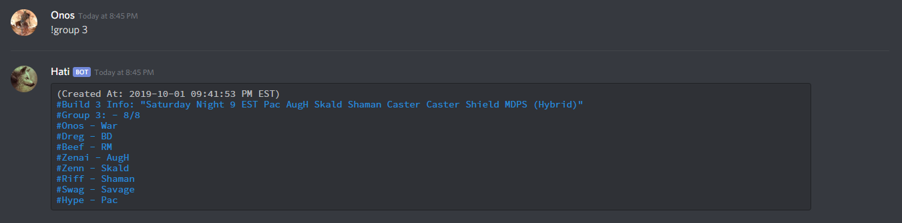
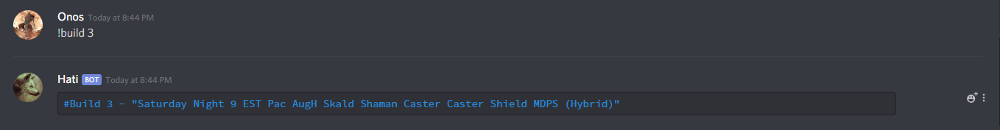
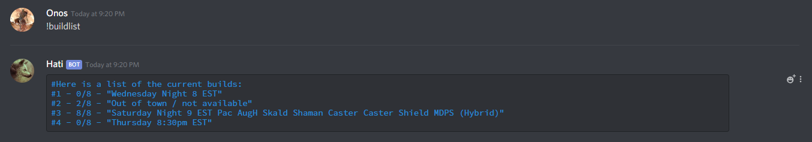
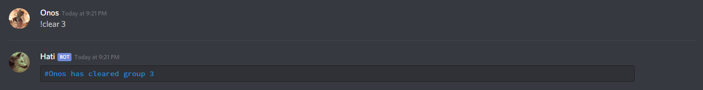
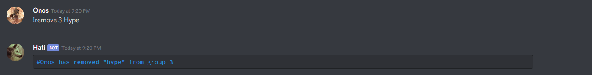
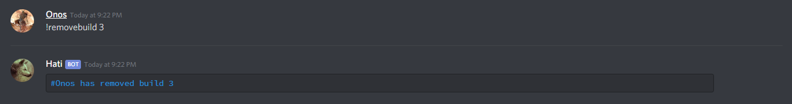

# Hati - A DAOC Discord Bot for RVR/Raid planning
Hati is a Discord chat bot built with Node.js/MongoDB and hosted on Heroku.

## Description:
Hati can help RVR/Raid planning with a variety of commands:

1. **!hatihelp** - Displays this list of available commands.

2. **!setbuild** - Sets the info for classes and build time for the specified group.

3. **!add** - Adds a player to the specified group

4. **!group** - Displays the current specified participants for the specified group.

5. **!build** - Displays the info for classes and build time for the specified group.

6. **!buildlist** - Displays all of the current builds that have been added.

7. **!clear** - Clears the specified group.

8. **!remove** - Removes a player from the specified group.

9. **!removebuild** - Removes a build from the build list. This will also remove the group associated with it.

## Usage:
Currently Hati needs to be setup with your own Heroku app/MongoDB instance/Discord Bot. Some minor settings are configurable in the config.json:
 - `"maintenance": false,` - Enables/Disabled Hati's maintenance mode. In maintenance mode, users are not allowed to make any changes to the DB and will be notified of the status with a message.
 - `"prefix": "!",` - Configures the prefix used for all commands. This can be changed if it conflicts with other bots used in your channel.
 - `"groupsize": 8` - Configures the displayed max group size for each group.

## To Do:
1. Build per guild MongoDB Collections to allow multiple guilds simultaneously and public access to the bot.
2. Raid reminders for signed up players.
3. Timeline display to better visualize starters/replacements across the build.

## Credits:
Thanks to:
- Hitori for inspiring me to create this bot after using her bot, Fenrir, when we played together.
- Everyone in Jorm for their support and for using this bot all the time :)